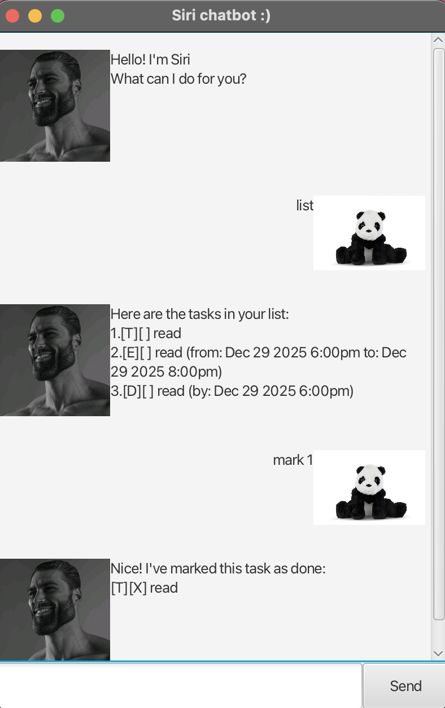

# Siri User Guide

Meet **Siri**, your desktop task management chatbot.



Let's walk you through the setup process and the 
features of **Siri**.


## Getting started
Get started by downloading **Siri** (siri.jar) from [here]. 

Next, move siri.jar into an empty folder and open the terminal in your desktop. 
In your terminal, navigate into that folder and type in `java -jar siri.jar`. 

Just like that, **Siri** will appear and say hi to you!


## Features
### Adding To Do tasks

Add tasks that have no time constraints to your task list.

**Format:** `todo <task description>`

**Example:**
```declarative
todo read a book
```

**Expected output:**
```declarative
Got it. I've added this task:
[T][ ] read a book
Now you have 1 task(s) in the list.
```
[T] represents a todo task.

### Adding Deadline tasks

Add tasks that have deadlines to your task list.

**Format:** `deadline <task description> /by <date and time in 
yyyy-MM-dd HHmm format>`

**Example:**
```declarative
deadline read a book /by 2026-12-29 1800
```

**Expected output:**
```declarative
Got it. I've added this task:
[D][ ] read a book (by: Dec 29 2026 6:00pm)
Now you have 2 task(s) in the list.
```
[D] represents a deadline task.

### Adding Event tasks

Add tasks that happen within a specific time period to your task list.

**Format:** `event <task description> /from <date and time in 
yyyy-MM-dd HHmm format> /to <date and time in 
yyyy-MM-dd HHmm format>`

**Example:**
```declarative
event networking session /from 2026-12-29 1800 /to 2026-12-29 1900
```

**Expected output:**
```declarative
Got it. I've added this task:
[E][ ] networking session (from: Dec 29 2026 6:00pm to: Dec 29 2026 7:00pm)
Now you have 3 task(s) in the list.
```
[E] represents an event task.

**Siri** will not allow you to add 2 events that have clashing time periods.

### View task list
Display all the tasks in your task list.

**Format:** `list`

**Example:**
```declarative
list
```

**Expected output:**
```declarative
Here are the tasks in your list:
1.[T][ ] read a book
2.[D][ ] read a book (by: Dec 29 2026 6:00pm)
3.[E][ ] networking session (from: Dec 29 2026 6:00pm to: Dec 29 2026 7:00pm)
```

### Marking a task done

Mark a task in your task list as done.

**Format:** `mark <task number>`

**Example:**
```declarative
mark 1
```

**Expected output:**
```declarative
Nice! I have marked this task as done:
[T][X] read a book
```

[X] represents a completed task.

### Marking a task undone

Unmark a task that was previously done.

**Format:** `unmark <task number>`

**Example:**
```declarative
unmark 1
```

**Expected output:**
```declarative
Okay. I have marked this task as not done yet:
[T][ ] read a book
```
[ ] represents an uncompleted task.

### Find a task

Search for a task by typing in a keyword.

**Format:** `find <keyword>`

**Example:**
```declarative
find read
```

**Expected output:**
```declarative
Here are the matching tasks in your list:
1.[T][ ] read a book
2.[D][ ] read a book (by: Dec 29 2026 6:00pm)
```

### Delete a task 

Remove a task from the task list.

**Format:** `delete <task number>`

**Example:**
```declarative
delete 1
```

**Expected output:**
```declarative
Noted. I've removed this task:
[T][ ] read a book
Now you have 2 task(s) in the list.
```

### Close Siri

Close the chatbot by saying goodbye.

**Format:** `bye`

**Example:**
```declarative
bye
```

**Expected output:**
```declarative
Bye. Hope to see you again soon!
```

The Graphical User Interface (GUI) will close a few seconds after the 
expected output.

**Siri** saves your task list automatically in your desktop. This means that 
your task list will be restored whenever you reopen **Siri**.